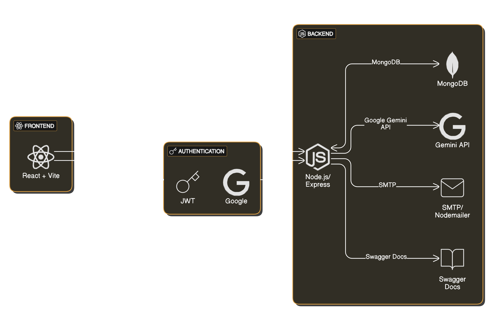

# XenoReach-CRM

A full-stack Customer Relationship Management (CRM) platform with AI-powered campaign generation and advanced customer segmentation.

---

## Table of Contents
- [Project Overview](#project-overview)
- [Architecture Diagram](#architecture-diagram)
- [Tech Stack & AI Tools](#tech-stack--ai-tools)
- [Local Setup Instructions](#local-setup-instructions)
- [API Documentation & Swagger UI](#api-documentation--swagger-ui)
- [Known Limitations & Assumptions](#known-limitations--assumptions)

---

## Project Overview
XenoReach-CRM enables businesses to:
- Manage customers, orders, and marketing campaigns.
- Build dynamic customer segments using a visual query builder or natural language.
- Generate campaign messages using Google Gemini AI.
- Analyze campaign performance with interactive dashboards.

---

## Architecture Diagram



---

## Tech Stack & AI Tools

### Frontend
- **React** (with Vite)
- **Tailwind CSS** & **MUI** (Material UI)
- **React QueryBuilder** (visual segment builder)
- **Recharts** & **Nivo** (data visualization)
- **fetch API** (all API requests; no axios)

### Backend
- **Node.js** & **Express**
- **MongoDB** (Mongoose ODM)
- **Nodemailer** (email delivery)
- **Passport.js** (Google OAuth)
- **JWT** (authentication)
- **Swagger** (API docs, served at `/api-docs` for interactive documentation)
- **dotenv** (env config)

### AI Tools
- **Google Gemini API**
  - Used for: Generating campaign messages, converting natural language to segment rules.
  - Library: `@google/generative-ai`

---

## Local Setup Instructions

### Prerequisites
- Node.js (v18+ recommended)
- npm or yarn
- MongoDB instance (local or cloud)
- Google Gemini API key
- Gmail account for email delivery (App Password required)
- Google OAuth credentials (Client ID/Secret)

### 1. Clone the Repository
```bash
git clone https://github.com/atul-10-01/XenoReach-CRM.git
cd XenoReach-CRM
```

### 2. Environment Variables

#### Backend (`server/.env`)
```
MONGODB_URI=mongodb+srv://<user>:<password>@<cluster-url>/xenoreach?retryWrites=true&w=majority
GOOGLE_CLIENT_ID=your_google_client_id
GOOGLE_CLIENT_SECRET=your_google_client_secret
PORT=3001
JWT_SECRET=strong_jwt_secret
GEMINI_API_KEY=your_gemini_api_key
EMAIL_USER=your_gmail_address@gmail.com
EMAIL_APP_PASSWORD=your_gmail_app_password
EMAIL_FROM_NAME=XenoReach CRM
FRONTEND_URL=http://localhost:5173
```

#### Frontend (`client/.env`)
```
VITE_GOOGLE_CLIENT_ID=your_google_client_id
VITE_API_URL=http://localhost:3001/api
```

### 3. Install Dependencies

#### Backend
```bash
cd server
npm install
```

#### Frontend
```bash
cd ../client
npm install
```

### 4. Run the Application

#### Start Backend
```bash
cd server
npm run dev
```

#### Start Frontend
```bash
cd ../client
npm run dev
```

- Frontend: [http://localhost:5173](http://localhost:5173)
- Backend API: [http://localhost:3001](http://localhost:3001)
- API Docs (Swagger): [http://localhost:3001/api-docs](http://localhost:3001/api-docs)

---

## API Documentation & Swagger UI

- The backend provides interactive API documentation using **Swagger UI** at [`/api-docs`](http://localhost:3001/api-docs).
- You can use Swagger UI to:
  - Explore all available API endpoints
  - View request/response schemas and example payloads
  - Authenticate with JWT (Bearer token) for protected endpoints
  - Try out API calls directly from the browser
- **Tip:** Use Swagger UI to demonstrate API usage during development, testing, or presentations.

---

## Known Limitations & Assumptions
- **AI-generated content** may require manual review for accuracy and tone.
- **Email delivery** uses Gmail SMTP; may be subject to rate limits and spam filtering.
- **No production-grade authentication** (for demo: JWT & Google OAuth only).
- **No Docker support** (manual setup required).
- **Assumes MongoDB is running locally or accessible via URI**.
- **Frontend and backend must be started separately**.
- **Environment variables must be set up manually**.

---

## Contributing
Pull requests are welcome! For major changes, please open an issue first to discuss what you would like to change.

---

